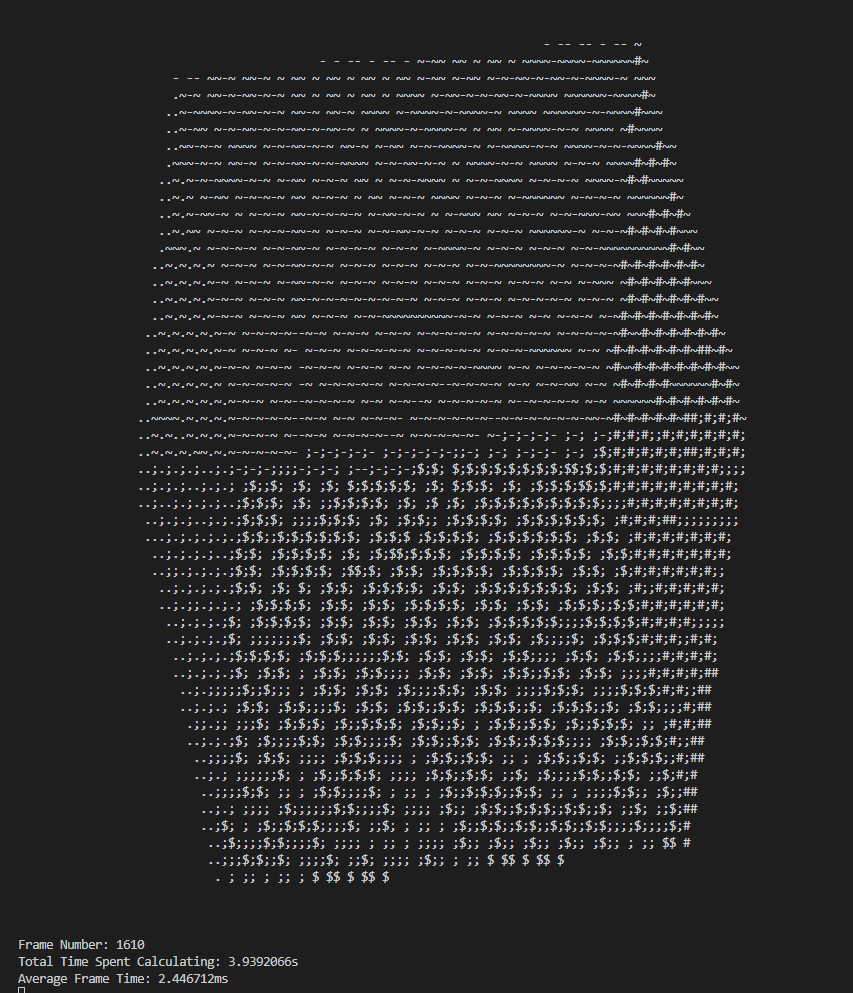
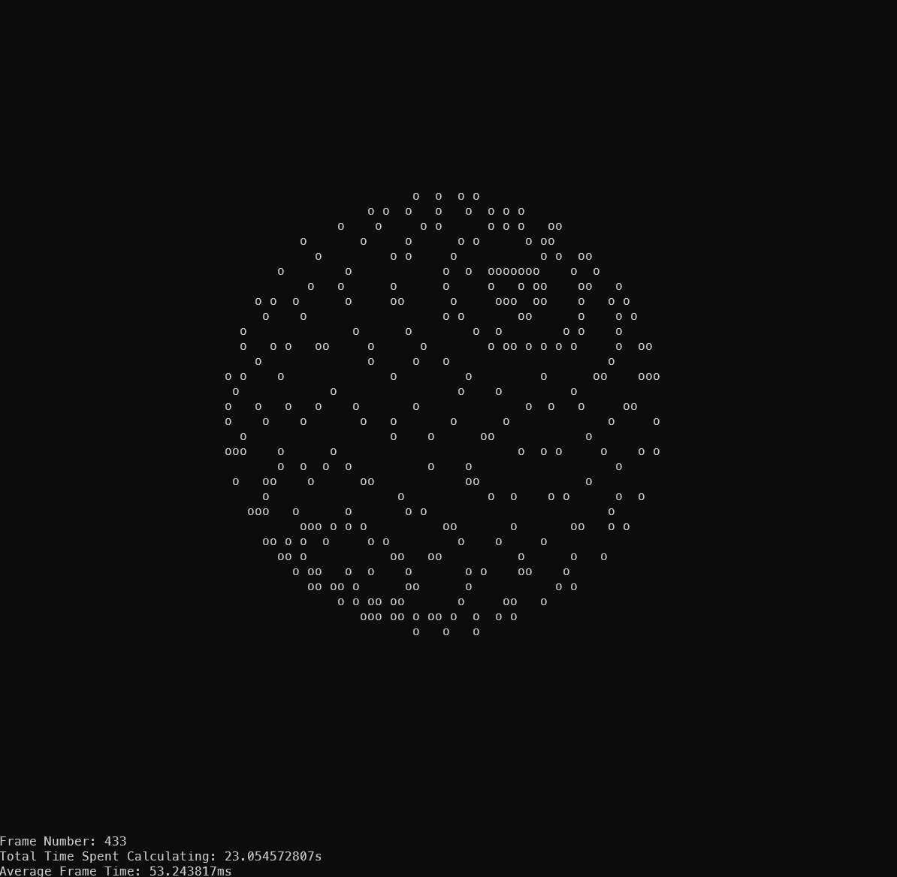
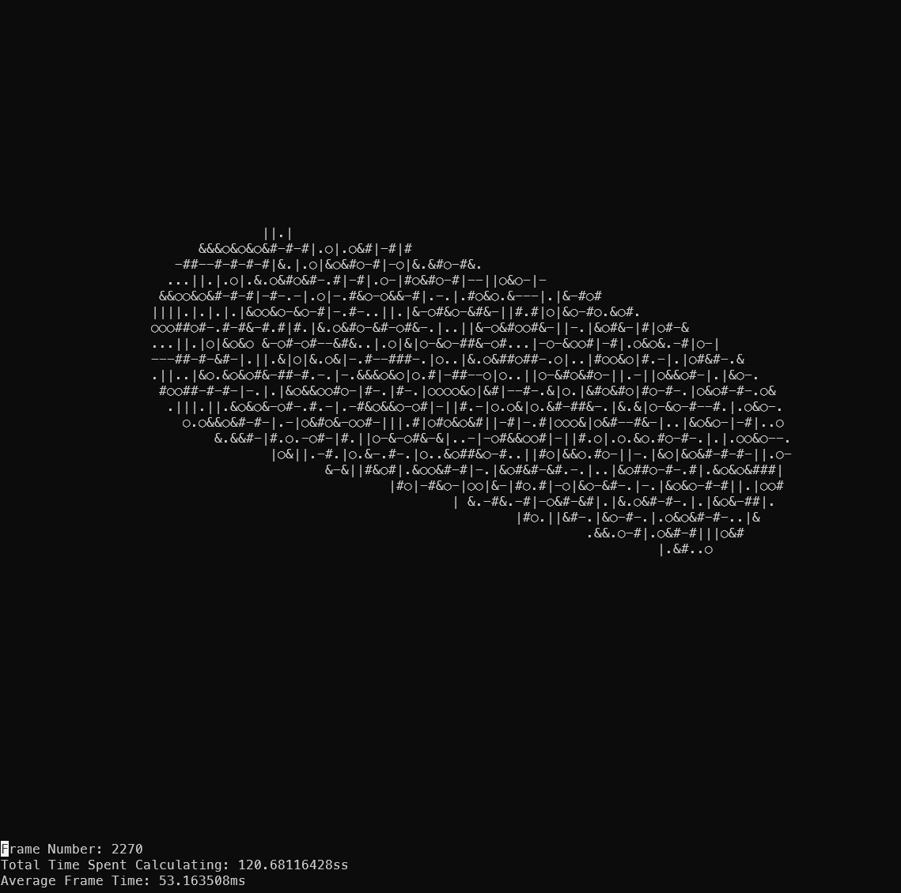
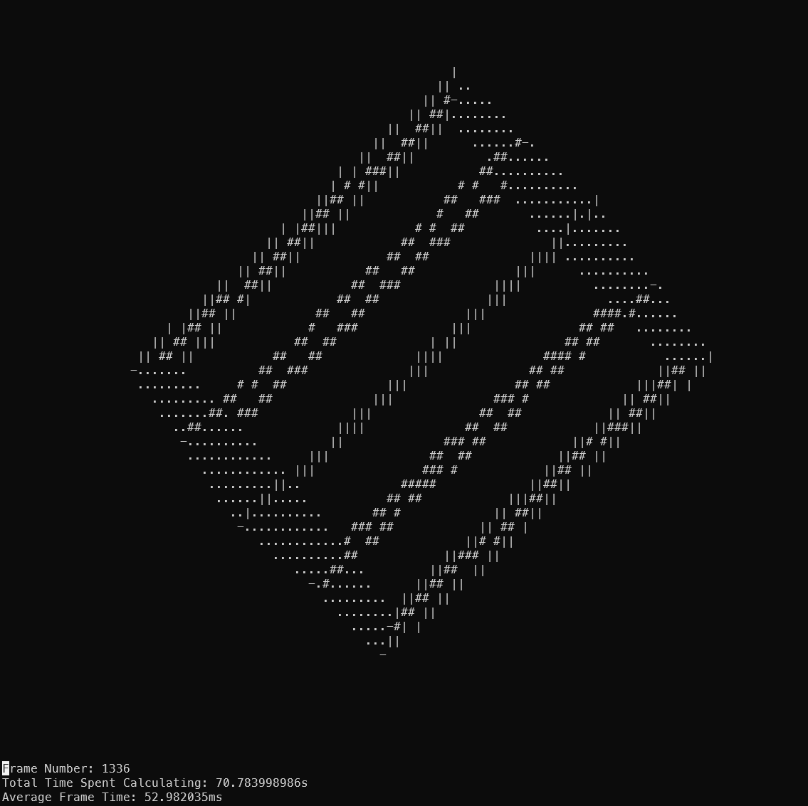

# Spinning Shapes

Title says it all, just some shapes spinning; small project to play around with Linear algebra and command-line ANSI printing in Rust.

In the main.rs file, you can find my final implementation.

## Dependencies

- iter_num_tools ~ need this for custom step iterating over negative floating point numbers.
- enable-ansi-support ~ used to enable ansi support.
